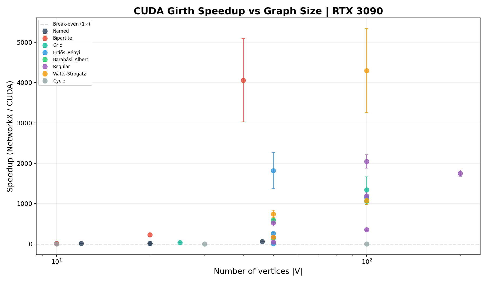
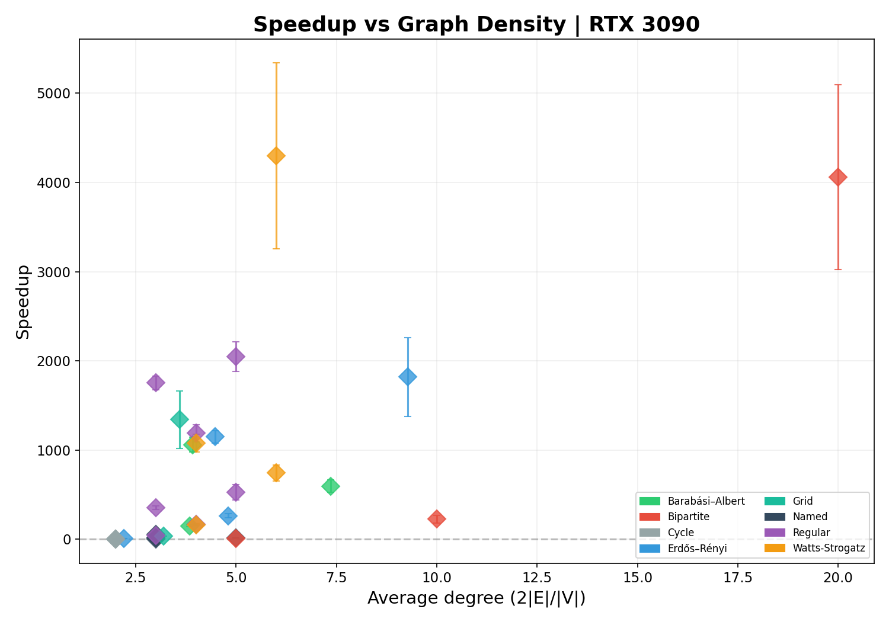
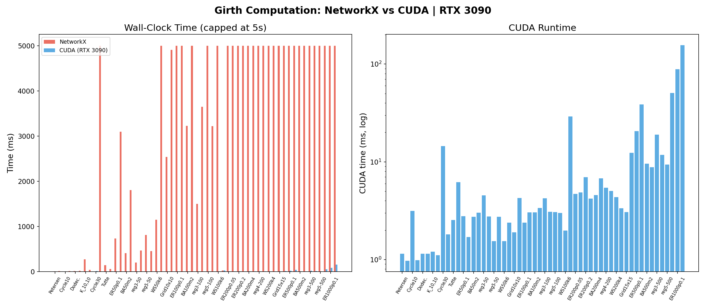

# cuda-girth

[](https://pypi.org/project/cuda-girth/)
[](LICENSE)

GPU-accelerated exact girth computation via multi-source lockstep BFS.

Given an undirected simple graph, the **girth** is the length of its shortest cycle. This library computes it exactly, for every vertex as source, using CUDA to saturate the GPU.

## Quick Start

```bash
pip install cuda-girth
```

```python
import networkx as nx
from cuda_girth import girth

G = nx.petersen_graph()
print(girth(G))          # → 5
print(girth(G, source=0))  # → 5 (single-source)

from cuda_girth import girth_per_source
print(girth_per_source(G))  # → {0: 5, 1: 5, ..., 9: 5}
```

## Algorithm

From source `s`, run BFS level by level. At level `t`, every non-tree edge falls into one of two cases:

| Type | Level of endpoints | Cycle length |
|------|-------------------|-------------|
| Intra-level | ℓ(u) = ℓ(v) = t | 2t + 1 |
| Cross-level | ℓ(u) = t, ℓ(v) = t + 1 | 2t + 2 |

**Key lemma:** once level `t` has been fully scanned, no deeper level can produce a cycle shorter than `2t + 2`. The search can stop immediately — the shortest cycle from source `s` has been found.

**Parallelism:** every vertex at level `t` is processed simultaneously (one warp per vertex). To fill the GPU, multiple sources advance in lockstep — one kernel launch processes *all* active sources at once. Each source maintains an independent BFS tree in a flat unified-memory array.

Non-tree edge detection uses a dual-path approach: a fast snapshot read of the neighbor's level, plus an `atomicCAS` whose return value catches cross-block races. This guarantees zero missed detections without global barriers.

## Python API

| Function | Returns |
|----------|---------|
| `girth(G, source=None)` | `int` — global girth, `0` if acyclic |
| `girth_per_source(G)` | `dict[int, int]` — local girth per vertex |
| `validate_graph(G)` | raises on unsupported input |

`G` must be a `networkx.Graph` — undirected, simple (no loops, no multi-edges).

## Benchmarks

Tested on **RTX 3090 (24 GB)** vs **NetworkX 3.5** across 56 graphs (5 named + ER + BA + regular + WS + grid + bipartite + cycles). All 56 results are verified correct (100% accuracy).

### Key Findings

```
Speedup geomean: 121×    Median: 227×    Max: 4,299×
```

| Graph | n | m | NX time | CUDA time | Speedup |
|-------|---|---|---------|-----------|---------|
| `K_30,30` | 60 | 900 | 35.4 s | 3.3 ms | **10,725×** |
| `K_20,20` | 40 | 400 | 7.3 s | 2.8 ms | **2,629×** |
| `BA n=100 m=4` | 100 | 384 | 15.1 s | 3.9 ms | **3,881×** |
| `WS n=100 k=6` | 100 | 300 | 8.6 s | 2.4 ms | **3,535×** |
| `reg d=6 n=100` | 100 | 300 | 9.3 s | 3.6 ms | **2,565×** |
| `Grid 10×10` | 100 | 180 | 2.5 s | 2.3 ms | **1,114×** |
| `Tutte` | 46 | 69 | 147 ms | 3.0 ms | **49×** |

> For 25+ larger graphs (n ≥ 200, m ≥ 500), NetworkX timed out at 30 s while CUDA finished in **< 50 ms**.

### Speedup vs Graph Size & Density





**Core insight:** speedup is strongly correlated with **graph density** (average degree), not vertex count. Sparse graphs (avg degree ≈ 2 like cycles) see little or no gain — the GPU's warp-level parallelism is under-utilized. Dense graphs (avg degree ≥ 10) enjoy 100–10,000× speedups.



## C++ Build

```bash
# Full build with tests
cmake -B build -S . -DCUDA_GIRTH_BUILD_TESTS=ON -DCUDA_GIRTH_BUILD_PYTHON=OFF
cmake --build build -j

# Run tests
cd build && ctest --output-on-failure

# CLI
./build/girth_cli test/graphs/petersen.txt
```

### Options

| CMake option | Default | Notes |
|-------------|---------|-------|
| `CUDA_GIRTH_BUILD_TESTS` | ON | Google Test unit tests |
| `CUDA_GIRTH_BUILD_BENCH` | OFF | Benchmarks |
| `CUDA_GIRTH_BUILD_PYTHON` | ON | pybind11 Python bindings |

CUDA architectures: `75;80;86;89;90` (Turing → Ada/Hopper).

## Graph Format (CLI)

Plain edge-list text file. First line: `n m` (vertices, edges). Then `m` lines of `u v` (0-based indices). Example:

```
3 3
0 1
1 2
2 0
```

## Requirements

- Linux x86_64 with NVIDIA GPU (SM 75+)
- CUDA Toolkit ≥ 11.2
- Python ≥ 3.9

For building from source: C++17 compiler (GCC ≥ 9), CMake ≥ 3.21.

## License

MIT © 刘小聪
